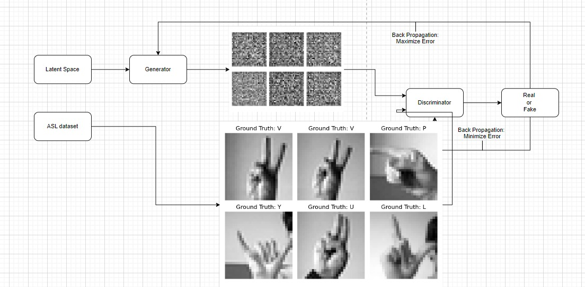
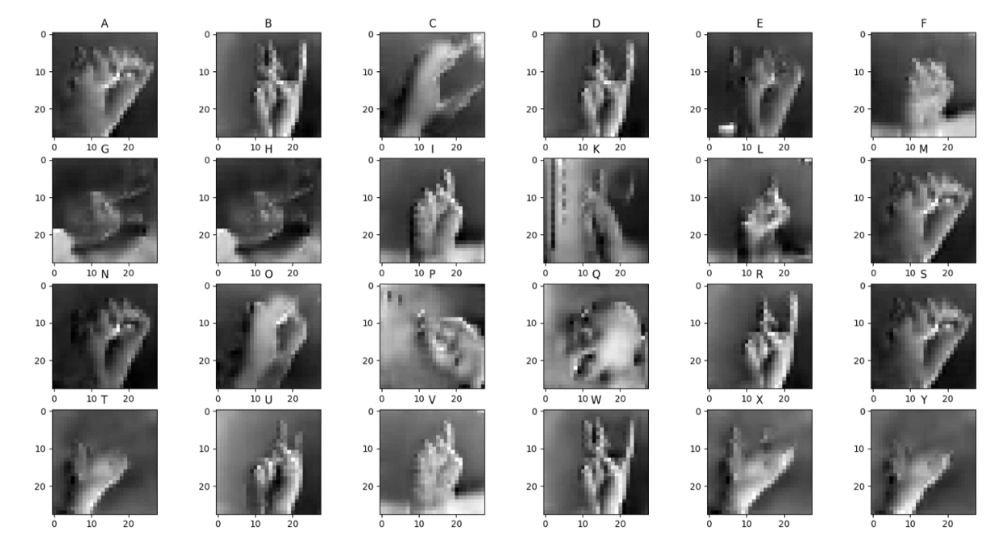

<h1 align="center">ASLetter – Generating ASL Images From Letters</h1>
<h2 align="center">Final project for the Technion's EE Deep Learning course (046211)
</h2> 

  

    Nir Ben Haim
   
    David Levit
  

## Background
 deep learning project - GAN which receives as input a letter in English and produces an image containing the letter as it is indicated in sign language (American Sign Language). 

### An illustration for the model: 

## Results
### original and generated images:
### original images:

### generated images:

## Files in the repository

| File name                                                     | Purpose                                                                                                                                       |
|---------------------------------------------------------------|-----------------------------------------------------------------------------------------------------------------------------------------------|
| `main.py`                                                     | general purpose main application                                                                                                              |
| `model.py`                                                    | generator amd discriminator models                                                                                                            |
| `train.py`                                                    | main application for training the model                                                                                                       |
| `util.py`                                                     | contain print results function and loss function                                                                                              |
| `data.py`                                                     | data loader                                                                                                                                   |
| `import_dataset.py`                                           | download data                                                                                                                                 |

## Running Example

| Arguments                                                     | Purpose                                                                                                                                       |
|---------------------------------------------------------------|-----------------------------------------------------------------------------------------------------------------------------------------------|
| `--eval`                                                      | Model evaluation if true. Model training and evaluating if false                                                                              |
| `--model_path`                                                | Model save/load directory                                                                                                                     |
| `--data_path`                                                 | Dataset save/load directorys                                                                                                                  |
| `--chosen_letter`                                             | Letter chosen to be printed, only when purely evaluating                                                                                      |

* In order to use the GAN without traning eval = True, model_path and data_path contains the wanted directory, and in order to get specific letter implement it in chosen_letter. 
* In order to retarin the GAN eval = False, model_path and data_path contains the wanted directory.

### Refrences
* [https://www.kaggle.com/datasets/datamunge/sign-language-mnist](https://www.kaggle.com/datasets/datamunge/sign-language-mnist).
